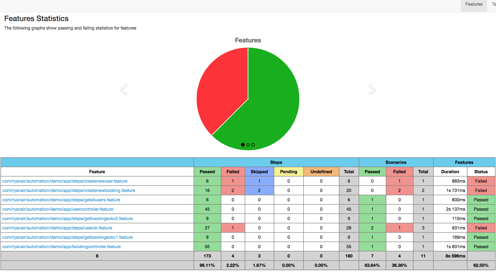

# Flight Booking API Tests

API tests for flight booking demo application

## Tech stack
* Java 8
* Maven
* Karate
* JUnit4
* Gherkin
* Cucumber bdd framework
* Cucumber html reporter plugin
* Log4j2
  
## Getting Started  
Software to be pre-installed: 
* JDK 8 - http://www.oracle.com/technetwork/java/javase/downloads/jdk8-downloads-2133151.html
* Maven - latest version here https://maven.apache.org/download.cgi

[Endpoints docs](http://127.0.0.1:8900/swagger-ui.html)

How to run this suite:
- usercontroller tests:
```sh
mvn -am -e -DfailIfNoTests=false clean test -Dlevel=debug -DTest=TestParallelRunner "-Dcucumber.options=--tags @UserController"
```
- bookingcontroller tests: 
```sh
mvn -am -e -DfailIfNoTests=false clean test -Dlevel=debug -DTest=TestParallelRunner "-Dcucumber.options=--tags @BookingController"
```

## Test reports

Test results report is generated by Cucumber report plugin. In order to view the report open the link of the `*.htlm` file located in `target/cucumber-html-reports` in any browser

Example of generated report:


## License
Project is licensed under [MIT](https://github.com/YuriyJurayev/fr-demo-api-test-karate/blob/master/LICENSE)
